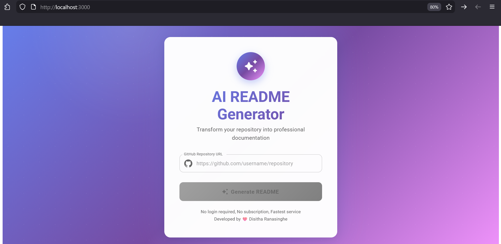
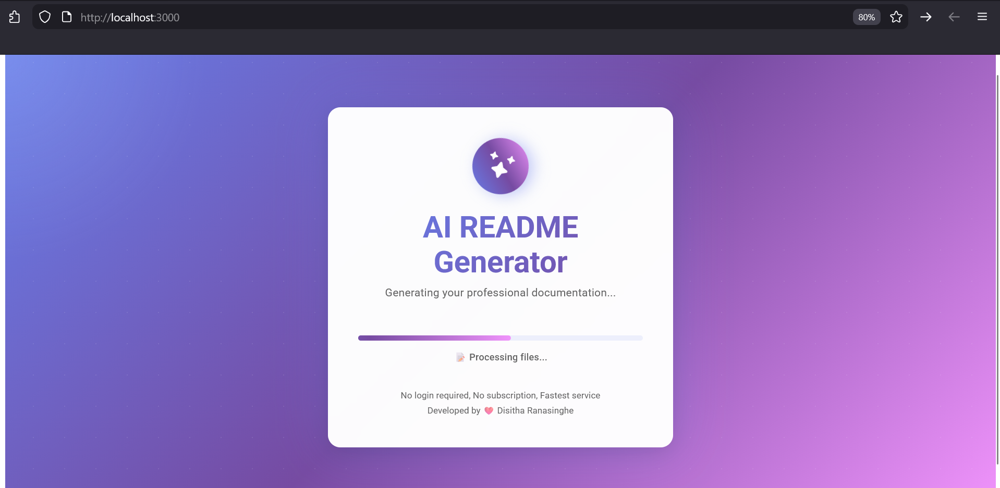
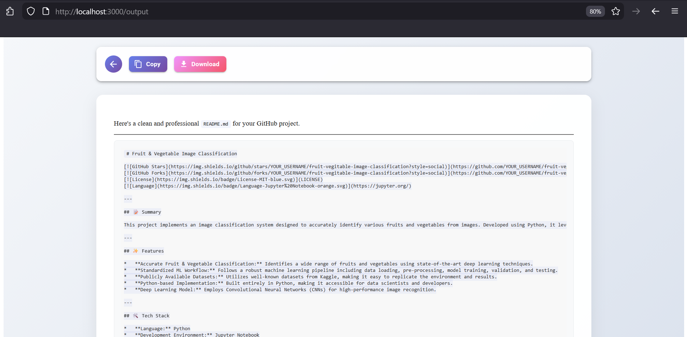

# AI-Powered-README-Generator


---

## Summary

The `AI-Powered-README-Generator` is an innovative tool designed to automate the creation of high-quality, professional `README.md` files for your GitHub projects. Leveraging advanced artificial intelligence and natural language processing, it takes a few key project details and generates a comprehensive, well-structured, and visually appealing README. This tool aims to save developers valuable time, ensure consistent project documentation, and help showcase projects effectively from the very beginning.

## Features

-   **Intelligent README Generation:** Utilizes AI to generate relevant and engaging content based on provided project information.
-   **Customizable Output:** Allows for tailoring sections and content to fit specific project needs.
-   **Standard Sections Inclusion:** Automatically includes essential sections like Summary, Features, Tech Stack, Installation, Usage, Contributing, and License.
-   **Markdown Formatting:** Generates clean, correctly formatted Markdown for easy integration into GitHub repositories.
-   **Time-Saving Workflow:** Drastically reduces the manual effort and time required to write comprehensive project documentation.
-   **Intuitive Command-Line Interface (CLI):** Easy-to-use prompts guide you through the README generation process.

## Tech Stack

This project is built using the following technologies:

-   **JavaScript:** The core programming language for the application logic.
-   **Node.js:** A JavaScript runtime environment that allows the application to run server-side and as a CLI tool.
-   **NPM (Node Package Manager):** Used for managing project dependencies and scripts.
-   **OpenAI API (or similar LLM service):** (Presumed for "AI-Powered") For natural language understanding and generation capabilities.
-   **Commander.js / Inquirer.js:** (Presumed for CLI) For building a robust and interactive command-line interface.

## Installation Steps

To get this project up and running on your local machine, follow these simple steps:

1.  **Clone the repository:**
    ```bash
    git clone https://github.com/YOUR_USERNAME/AI-Powered-README-Generator.git
    ```
    *(Remember to replace `YOUR_USERNAME` with your actual GitHub username or the organization's name)*

2.  **Navigate into the project directory:**
    ```bash
    cd AI-Powered-README-Generator
    ```

3.  **Install the dependencies:**
    ```bash
    npm install
    ```
    or if you prefer Yarn:
    ```bash
    yarn install
    ```

4.  **(Optional) Link the CLI tool globally:**
    If you want to run the generator from any directory, you can link it:
    ```bash
    npm link
    ```

## Usage Instructions

Once installed, generating a README is straightforward:

1.  **Run the generator:**
    If you linked the tool globally:
    ```bash
    ai-readme-gen
    ```
    Otherwise, run it from the project directory:
    ```bash
    npm start # Or `npm run generate` if configured
    ```

2.  **Follow the interactive prompts:**
    The CLI will guide you through a series of questions about your project, such as:
    *   Project Name
    *   Short Description
    *   Key Features
    *   Tech Stack
    *   Installation Commands
    *   Usage Examples
    *   License Type
    *   And more...

3.  **Review and Customize:**
    After answering the prompts, a `README.md` file will be generated in your project's root directory. You can then open this file, review its content, and make any final manual adjustments or additions.

## Contributing

Contributions are what make the open-source community such an amazing place to learn, inspire, and create. Any contributions you make are **greatly appreciated**.

If you have a suggestion that would make this better, please fork the repo and create a pull request. You can also open an issue with the tag "enhancement". Don't forget to give the project a star! Thanks!

1.  Fork the Project
2.  Create your Feature Branch (`git checkout -b feature/AmazingFeature`)
3.  Commit your Changes (`git commit -m 'Add some AmazingFeature'`)
4.  Push to the Branch (`git push origin feature/AmazingFeature`)
5.  Open a Pull Request

Please ensure your code adheres to the existing style and conventions.

## License Section

This project is licensed under the MIT License - see the [LICENSE](LICENSE) file for details.

---
## Images
| Home Page | Loading Page | Result Page |
|-----------|-------------|------------|
|  |  |  |


